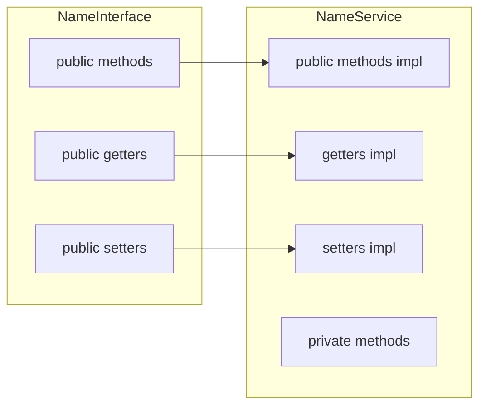

# Service Guidelines

Guide on how a service should be structured and organized.

- A service must follow class guidelines. See [classes.md](./classes.md)
- A service must pass all linters using `make run-linter-checks FILE=path/to/file.py` or `./scripts/make/run-linter-checks.sh --file path/to/file.py`
- A service must have a corresponding interface. See [interfaces.md](./interfaces.md)
- For variable naming conventions, see [variables.md](./commons/variables.md)
- For complex types, create models instead of using `Dict[str, Any]` or similar. See [models.md](./commons/models.md)

# 1.0 Service Structure

```python
class NameService(NameInterface):
    # Constants (UPPER_CASE)
    # {Blank separator line}

    # Variables (_lower_case with underscore prefix)
    # {Blank separator line}

    # External services or class definitions
    # {Blank separator line}

    # Initialization function __init__
    # {Blank separator line}

    # Public methods (sorted alphabetically, defined in interface)
    # {Blank separator line}

    # Private methods (sorted alphabetically, NOT in interface)
    # {Blank separator line}

    # Getters (implementation of interface getters)
    # {Blank separator line}

    # Setters (implementation of interface setters)
    # {Blank separator line}
```

# 2.0 Service and Interface Relationship

Every service must have a corresponding interface that defines:

- Public methods (abstract)
- Public getters (`@property @abstractmethod`)
- Public setters (`@<name>.setter @abstractmethod`)

The service implements all abstract members from the interface.



# 3.0 What Goes Where

| Element           | Interface                   | Service                    |
| ----------------- | --------------------------- | -------------------------- |
| Public methods    | `@abstractmethod`           | Implementation             |
| Public getters    | `@property @abstractmethod` | `@property` implementation |
| Public setters    | `@setter @abstractmethod`   | `@setter` implementation   |
| Private methods   | Never                       | Yes                        |
| Private variables | Type hints only             | Initialization and usage   |
| Constants         | Never                       | Yes                        |

# 4.0 Example

## 4.1 Interface (`interfaces/orderbook.py`)

```python
from abc import ABC, abstractmethod

class OrderbookInterface(ABC):
    _balance: float
    _orders: Dict[str, OrderModel]

    @abstractmethod
    def open(self, order: OrderModel) -> None:
        pass

    @abstractmethod
    def close(self, order: OrderModel) -> None:
        pass

    @property
    @abstractmethod
    def balance(self) -> float:
        pass

    @property
    @abstractmethod
    def nav(self) -> float:
        pass

    @nav.setter
    @abstractmethod
    def nav(self, value: float) -> None:
        pass
```

## 4.2 Service (`services/orderbook/__init__.py`)

```python
from interfaces.orderbook import OrderbookInterface

class OrderbookService(OrderbookInterface):
    _balance: float
    _orders: Dict[str, OrderModel]

    def __init__(self, balance: float) -> None:
        self._balance = balance
        self._orders = {}

    def open(self, order: OrderModel) -> None:
        self._validate_order(order)
        self._orders[order.id] = order

    def close(self, order: OrderModel) -> None:
        del self._orders[order.id]

    def _validate_order(self, order: OrderModel) -> None:
        if order.volume <= 0:
            raise ValueError("Volume must be positive")

    @property
    def balance(self) -> float:
        return self._balance

    @property
    def nav(self) -> float:
        return self._balance + self._calculate_pnl()

    @nav.setter
    def nav(self, value: float) -> None:
        self._nav = value

    def _calculate_pnl(self) -> float:
        return sum(order.profit for order in self._orders.values())
```

# 5.0 File Location

Services are located in `services/` directory:

- `services/orderbook/__init__.py` + `interfaces/orderbook.py`
- `services/gateway/__init__.py` + `interfaces/gateway.py`
- `services/strategy/__init__.py` + `interfaces/strategy.py`

# 6.0 Anti-patterns to Avoid

- **Service without interface**: Every service must have a corresponding interface
- **Public getters/setters only in service**: Define them in the interface first
- **Private methods in interface**: Interfaces only contain public contracts
- **Business logic in interface**: Interfaces define what, not how
- **Missing `super().__init__()`**: If extending another service, always call parent constructor
- **Circular dependencies**: Use `TYPE_CHECKING` imports if needed
